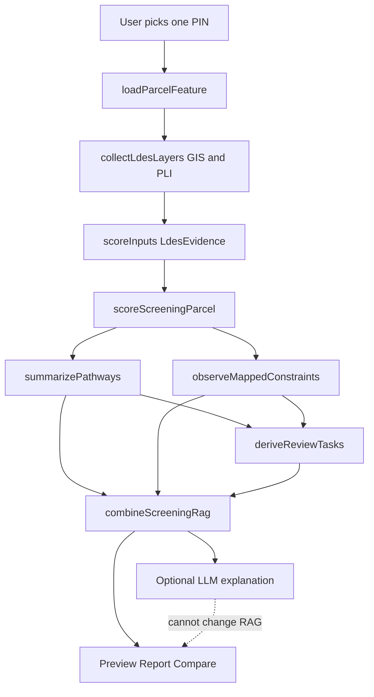
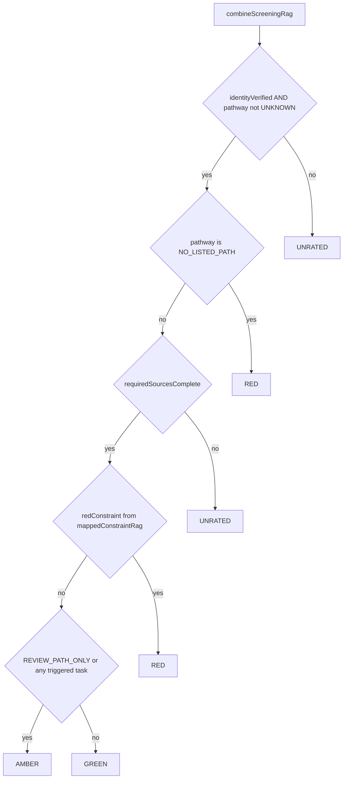

# LDES v3: preliminary developer screening scorecard

`scoreVersion = LDES-v3-screening-scorecard` is the default result shown in the map preview, full report, and comparison. The user chooses one canonical Parcel ID, usually from an address candidate list. The interface calls it **Development Ease Score — Preliminary zoning & site screen**. It answers whether a Pittsburgh parcel merits the next round of residential development due diligence and what to verify first. It is a four-level RAG, not a calibrated 0–100 score or a verdict on a proposed project.

## Scope and input

The screen checks the five verified residential use rows in the [Pittsburgh §911.02 table](https://ecode360.com/45476784), parcel zoning, 25%+ slope, landslide-prone and undermined polygons, FEMA flood areas, historic district/site polygons, and active PLI violation/condemnation records. Parcel identity, polygon boundary, city jurisdiction, complete base-district zoning, and required source availability are evidence gates. No housing type, unit count, building footprint, land-control status, or price assumption is collected by default.

The scorecard contains `pathwaySummary`, five `housingPathways` rows, per-source `mappedConstraints`, deduplicated `reviewTasks`, `evidenceGaps`, `unassessed`, `screeningRag`, and `projectFeasibility = NOT_ASSESSED`. Every row retains source URL and available source/retrieval dates. The same address can return multiple PINs; each PIN is screened independently.

## How grading is generated

The headline is a four-level RAG (`GREEN | AMBER | RED | UNRATED`), not a 0–100 score. The only scoring entry point is the pure function `scoreScreeningParcel` in [`src/lib/screening/scorecard.ts`](../src/lib/screening/scorecard.ts). Preview, full report, and comparison consume the same `ScreeningScorecard`. `projectFeasibility` is always `NOT_ASSESSED`. The optional LLM may explain the facts; it cannot change the RAG.

Evidence is assembled in [`src/lib/parcelReport.ts`](../src/lib/parcelReport.ts) and [`src/lib/ldes.ts`](../src/lib/ldes.ts). [`src/lib/reportView.ts`](../src/lib/reportView.ts) calls `scoreScreeningParcel(selected)`.

`scoreScreeningParcel` composes four steps, then applies the ordered RAG rule:

1. Identity gate `identityVerified`
2. Housing pathway `pathwaySummary` plus five `housingPathways` rows (`summarizePathways` in [`src/lib/screening/pathways.ts`](../src/lib/screening/pathways.ts))
3. Mapped layers `mappedConstraints`, `evidenceGaps`, and `requiredSourceCoverage` (`observeMappedConstraints` in [`src/lib/screening/constraints.ts`](../src/lib/screening/constraints.ts))
4. `reviewTasks` (`deriveReviewTasks` in [`src/lib/screening/tasks.ts`](../src/lib/screening/tasks.ts)), then `combineScreeningRag` in [`src/lib/screening/rag.ts`](../src/lib/screening/rag.ts), including `redConstraint` when any mapped layer RAG is RED

### Identity gate

All of the following must be true: canonical PIN, `cityVerified`, `polygonVerified`, `parcelMatchCount === 1`, `parcelGeometry === POLYGON`, and assessment PARID matching the PIN when an assessment is present. Failure inserts a `parcel-identity` gap and grades **UNRATED**.

### Housing pathways

Any evidence gap makes `pathwaySummary = UNKNOWN` (point zoning, unhandled overlay, split base district, or a missing use-table cell cannot become by-right by assumption):

- City jurisdiction or parcel polygon is not verified
- Zoning is not polygon-verified, or `joinMethod === point_lookup`
- The parcel does not have exactly one base district
- An overlay is present but not handled
- The five residential rows are not all `verified`, or they do not match the district

When there is no gap:

- Any row `P` → `BY_RIGHT_PATH_IDENTIFIED`
- No `P`, but at least one of `A | S | C | P_OR_S` → `REVIEW_PATH_ONLY`
- Otherwise → `NO_LISTED_PATH` (these five uses only; not a claim that the parcel is unbuildable)

### Mapped constraints and required sources

Six layers: slope, landslide, undermined, FEMA, historic district, historic site. Two additional PLI sources, `violations` and `condemned`, are required for coverage but are not stored in `mappedConstraints`. Per-layer RAG comes from `mappedConstraintRag` in [`src/lib/screening/hazards.ts`](../src/lib/screening/hazards.ts).

| Source status | Constraint status | Effect on grade |
|---|---|---|
| `unavailable` or empty value | `UNKNOWN` | Evidence gap; UNRATED if a listed housing path exists |
| `not_found` or effective zero overlap | `NOT_DETECTED` | No targeted task |
| Effective overlap | `DETECTED`, `projectImpact=UNKNOWN` | Layer RAG is GREEN, AMBER, or RED from versioned overlap thresholds |
| Fragment under **10 sq ft and 0.1%** | `boundaryUncertain`; effective overlap treated as 0 | Ordinary layers do not trigger Amber; a tiny FEMA hit stays `UNKNOWN` → UNRATED pending boundary verification |

`requiredSourcesComplete` is true only when all eight sources (`available` or `not_found`) and no mapped constraint is `UNKNOWN`. Overlap area and percent remain visible as facts. Successful zero/no-record and source failure remain distinct.

### Review tasks

- `triggered`: `REVIEW_PATH_ONLY`; mapped `DETECTED` whose layer RAG is not GREEN; `activeCondemned`; `activeViolation`
- `gap`: one task per evidence gap (does not turn Green into Amber by itself; a missing required source is UNRATED in the next step)
- `routine`: Green-band mapped hits, intended housing use/size/location, land control, and financial feasibility (**does not change the grade**)

Closed violation history is context only and does not create a triggered task.

## Ordered grading rule

The first matching condition wins (`combineScreeningRag`):

1. **UNRATED** if canonical PIN, a unique Pittsburgh polygon boundary, or the complete zoning use path cannot be verified.
2. **RED** if the complete verified table has no listed path for any of the five checked housing uses. Other source gaps remain visible.
3. **UNRATED** if a listed housing path exists but any required slope, landslide, undermined, FEMA, historic district/site, violation, or condemnation source is unavailable or its geometry is unresolved.
4. **RED** if a verified major mapped constraint is present: 25%+ steep slope or landslide-prone overlap is **50% or more**; SFHA overlap is **50% or more**; or any effective regulatory floodway overlap is detected. This is a major screening constraint, not a finding that the parcel cannot be developed.
5. **AMBER** if the only listed path needs review (`A`, `S`, `C`, or `P_OR_S`), or a verified mapped/active-record fact generates a targeted review task. Amber applies to 25%+ steep slope or landslide-prone overlap from **10% to less than 50%**; any effective undermined-area overlap; 0.2% annual-chance flood overlap of **10% or more**; SFHA overlap below 50%; a historic district/site hit outside the boundary tolerance; or an active violation/condemnation record. Amber means **investigate before deciding**. A parcel overlap does not establish that the proposed footprint is affected.
6. **GREEN** if at least one use is listed `P`, all required sources succeeded, and no targeted task was triggered. Steep-slope, landslide-prone, or 0.2% annual-chance flood overlap below **10%** remains visible as a mapped fact and routine location check, but does not by itself change the headline grade. Green means no targeted task was found in the checked scope; ordinary project diligence remains.

These are versioned screening thresholds, not engineering, grading, insurance, designation, or permitting limits. Steep slope and landslide use `<10% = GREEN`, `10%–<50% = AMBER`, and `≥50% = RED`. Undermined area uses any effective overlap as AMBER because parcel percentage does not reveal mine depth or overburden. A historic district/site overlap is routine context only when it is both **under 1% and under 100 sq ft**; otherwise it is AMBER. FEMA 0.2% annual-chance flood uses `<10% = GREEN` and `≥10% = AMBER`; SFHA uses `<50% = AMBER` and `≥50% = RED`; any effective regulatory floodway overlap is RED.

The overlap area and percent remain visible as facts. A general polygon fragment under **10 sq ft and 0.1%** is labelled boundary-uncertain and does not itself trigger Amber. An unresolved tiny FEMA hit is UNRATED pending boundary verification, particularly because floodway classification can be consequential. Successful zero/no-record and source failure remain distinct.

Worked checks: `0052P00130000000` (EMI, detached `P`, 2.208% slope) stays Green from that slope hit; 55% slope or landslide overlap is Red; point or split zoning is Unrated; five `NOT_PERMITTED` rows stay Red even if FEMA failed.

## Interpretation and limitations

`BY_RIGHT_PATH_IDENTIFIED` means at least one of the five base-district listings is `P`; it does not say the user's planned housing use, dimensions, parking, access, overlay conditions, or permit is approved. `REVIEW_PATH_ONLY` means at least one discretionary/review listing and no `P`. `NO_LISTED_PATH` refers only to those five rows. `UNKNOWN` means evidence does not support a reliable use-path summary.

The report separates mapped observations, next checks, evidence gaps, and project questions not assessed. Default unassessed items are intended housing use/size/location, land control, site engineering and mitigation cost, and financial feasibility. Active condemned and violation records create official-status checks; closed violation history remains context. [`screeningPresentation`](../src/lib/screening/presentation.ts) and [`buildScreeningFallback`](../src/lib/screening/copy.ts) only translate the RAG into fixed copy. Comparison warns when rule versions or source coverage differ; it does not rank parcels by color. The optional LLM receives only the deterministic scorecard facts and may explain them in plain language; it cannot change the RAG. On timeout, provider failure, budget exhaustion, or rejected output, the fixed source-based summary and raw facts remain.

## Validation

Tests cover ordered precedence, all five use rows, split/point zoning, confirmed zero versus failed source, boundary fragments, category-specific FEMA treatment, PLI status, the `0052P00130000000` EMI/2.208% slope case, slope and landslide boundaries, historic tolerance, and the four earlier real-parcel geospatial observations under explicitly completed other-source assumptions. See [v3 review ledger](verification/screening-v3-cases.md). The small set exposes counterexamples but does not establish predictive accuracy. A 12–20-case review by a local planning or development practitioner remains pending.

For historical v2.3 behavior and fixtures, see [LDES v2.3](LDES_v2.3_parcel_screen.md).
