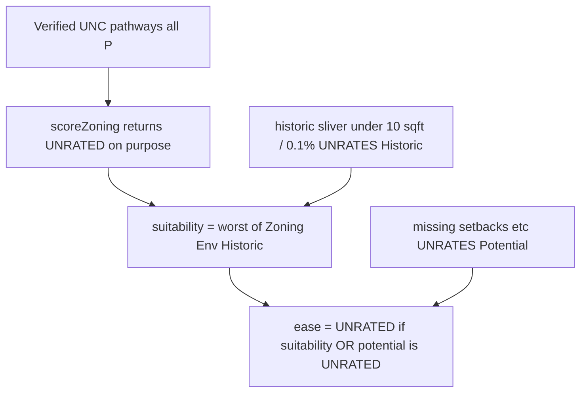

# 解开“数据已够仍整单 UNRATED”

## 这块地实际发生了什么

[4749 Baum Blvd](http://127.0.0.1:5173/) 的矩阵已经正确：单一 base district **UNC**，五类住宅都是 **P / GREEN**。环境芯片也是 **GREEN**。主标还是 UNRATED，原因写着 `unresolved historic geometry boundary`，不是缺 use table。

当前合成链：

三处叠加：

1. **Zoning 芯片被故意打成 UNRATED**（[src/lib/ldes/zoning.ts](src/lib/ldes/zoning.ts) 第 92–97 行：只要有 verified `housingPathways` 就 `return UNRATED`）。矩阵绿了，芯片仍灰。
2. **Historic 细条交叉当硬门槛**（[src/lib/ldes/historic.ts](src/lib/ldes/historic.ts) 第 25–34 行）。`isSliver`（&lt;10 sqft 且 &lt;0.1%）在洪水层是降噪；在历史层却整维 UNRATED，并打上 `UNRESOLVED_GEOMETRY_BOUNDARY`，Evidence 变成 `NOT_RATED`（[src/lib/score.ts](src/lib/score.ts) 第 42 行）。
3. **主标被 Potential UNRATED 一票否决**（[src/lib/ldes/combine.ts](src/lib/ldes/combine.ts) `O05`：suitability GREEN + potential UNRATED → 整单 UNRATED）。尺寸表未入库是第一阶段诚实缺口，不应再挡住已评级的 zoning/环境/历史。

## 新合成规则（按你的选择）

- **有 RED → 整单 RED**（含 use variance / condemned / 硬约束）。
- **其余取已评级维度的较低色**（GREEN+AMBER → AMBER；全 GREEN → GREEN）。RAG 没有数值平均，等价于 `worst` of rated colors。
- **Development potential 继续诚实 UNRATED**（缺 setbacks/coverage/height/FAR/parking/access/overlay 尺寸）。**它不再把主标打成 UNRATED**。
- **查询失败、overlay 未处理、真缺 use table、洪泛细条会改分类** 仍让该维 UNRATED，并继续拖 suitability / 主标（数据不够 ≠ 忽略）。

对 Baum：Zoning GREEN、Env GREEN、Historic 细条降噪后 GREEN、Potential UNRATED → **主标 GREEN**，Potential 芯片仍 UNRATED，文案写清尺寸表未评。

## 实现

**Zoning 芯片** — [src/lib/ldes/zoning.ts](src/lib/ldes/zoning.ts)

- 删除 “verified pathways → 强制 UNRATED”。
- 单一 `districtKey`：用已核路径的 **最严**（P &lt; A/S/C/P_OR_S &lt; NOT_PERMITTED）着色。UNC 五条 P → GREEN。R1D 若含 two-unit NOT_PERMITTED → Zoning RED（矩阵仍逐行展示）。
- **跨两个不同 base district：仍不合成一色**，Zoning 保持 UNRATED + split-zoned 说明（与原 use-table 方案一致）。
- Overlay 未处理、会改路径的 zoning sliver：继续 UNRATED。

**Historic 细条** — [src/lib/ldes/historic.ts](src/lib/ldes/historic.ts) + [src/lib/ldes.ts](src/lib/ldes.ts)

- 与洪水普通 sliver 一致：细条 **视为未相交**，记 context `POSSIBLE_BOUNDARY_SLIVER`，**不要** UNRATED / `UNRESOLVED_GEOMETRY_BOUNDARY`。
- `historicDistrict` / `individualHistoricSite` 用 `effectiveOverlap`，不要 `overlapPct > 0`（细条现在会把 boolean 打成 true）。
- 查询失败仍 UNRATED。

**主标** — [src/lib/ldes/combine.ts](src/lib/ldes/combine.ts)

- `useVariance` 或 suitability/potential 任一 **RED** → RED。
- potential 为 UNRATED 时：`easeScore = suitabilityRag`（suitability 仍 UNRATED 则主标 UNRATED）。
- 两者都已评级：`worst`（取低者）。

**文案** — [src/panel/ParcelDetails.tsx](src/panel/ParcelDetails.tsx) / `scoreSummary`

- 主标已评级但 Potential UNRATED 时，摘要写：ease 来自已核 suitability；development potential 仍缺尺寸/overlay/停车，不是许可。
- 去掉把 historic 细条写成整单 “NEEDS FURTHER EVIDENCE — unresolved historic geometry boundary” 的误导。

## 测试

- 新增：单一 UNC 五条 verified P + potential 缺尺寸 → `zoningRag GREEN`，`developmentPotentialRag UNRATED`，`easeScore GREEN`。
- 新增：historic overlap sliver → `historicConditionRag GREEN`（或 Amber 仅当真相交），无 `UNRESOLVED_GEOMETRY_BOUNDARY`。
- 新增：R1D 含 NOT_PERMITTED 行 → Zoning RED，主标 RED。
- 新增：R1D+R2 split → Zoning UNRATED，矩阵两区两色。
- 更新 fixture **O05 / P01** 的 `ease_score`：GREEN suitability + UNRATED potential → **GREEN**（`development_potential_rag` 仍 UNRATED）。**O04**（suitability UNRATED）保持 UNRATED。G05 overlay 未处理保持 UNRATED。

浏览器：再开 4749 Baum Blvd，确认 Zoning/Historic 不再灰、主标随已评级维走、Potential 仍 UNRATED、五条 UNC 路径仍在。
